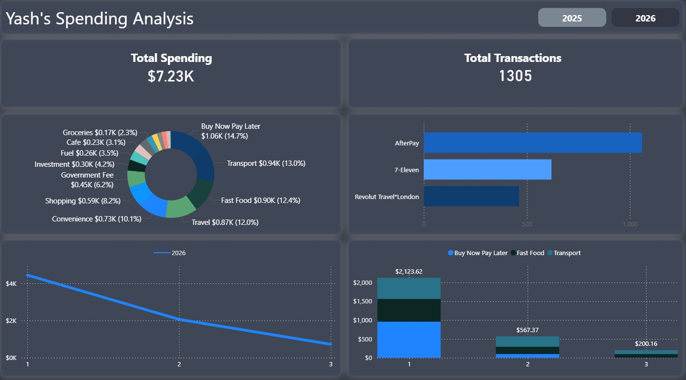

# Personal Finance Spending Analysis Dashboard

## Project Overview
This project analyses personal spending behaviour using bank transaction data. The data was processed using MySQL and visualised in Power BI through an interactive dashboard.

The goal of this project was to build a simple, refreshable analytics workflow to track spending patterns, identify major expense categories, and understand financial behaviour over time.

---

## Tools Used
- MySQL  
- SQL (Views & Aggregations)  
- Power BI  
- CSV / Excel  

---

## Workflow
1. Transaction data exported as CSV  
2. Cleaned and pre-processed data in Excel, including creating a `category` column using a custom category mapping for transaction classification
3. Imported the cleaned dataset into a MySQL database  
4. SQL views created for:
   - Category-wise spending  
   - Monthly spending trends  
   - Merchant-level spending  
   - Category share by month  
   - Year-based filtering (included directly in SQL views)  
5. Connected Power BI to SQL outputs  
6. Built an interactive dashboard with a year slicer  

---

## SQL Views
SQL views were created to structure and aggregate the data for analysis. Each view includes a `year` column derived from the transaction date, enabling consistent filtering across all visuals in Power BI.

---

## Dashboard Preview

## Dashboard Features
- Total spending
- Total transactions
- Spending by category
- Top 3 merchants
- Monthly spending trend
- Category spending by month
- Year filter

---

## Key Insights

- Total spending across the period is **$15,720**, with **Buy Now Pay Later** contributing **$5,081 (32.3%)**, making it the dominant expense category.
- Spending is highly concentrated, with the **top 5 categories (BNPL, Convenience, Fast Food, Travel, Transport)** accounting for **~70% of total expenditure**.
- **AfterPay alone contributes $5,081 (32.3%)**, making it the single largest merchant and aligning directly with BNPL spending.
- Monthly spending peaked in **January 2026 ($4,444)** and dropped to **$721 in March 2026**, representing an **83.8% decrease**.
- Spending increased rapidly in late 2025, growing from **$468 in September to $3,896 in December (8.3× increase)** before peaking.
- BNPL dominated late 2025, contributing up to **62.1% of monthly spending in September 2025**, but reduced to **21.6% by January 2026**.
- Spending patterns shifted in 2026:
  - **February 2026** driven by **Government Fees (21.8%)**
  - **March 2026** dominated by essentials, especially **Fuel (23.5%)**
- Core categories such as **Transport, Food, and Travel** remain consistent across all months.
